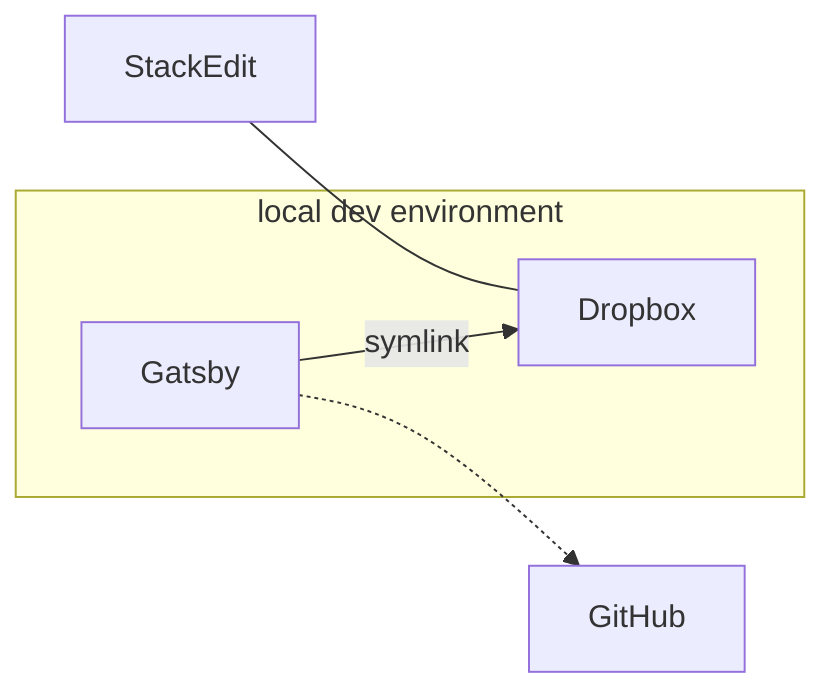

I've been blogging for a little over a year now and have put a lot of effort into finding the best way to blog. Here's a workflow that works pretty well for me:

I write my blog posts in [StackEdit](https://stackedit.io/), an awesome Markdown editor that makes it really easy to write whenever an idea comes to mind. StackEdit then syncs with my Dropbox, which is [symlinked](https://en.wikipedia.org/wiki/Symbolic_link) to a `drafts` folder in my local Gatsby development environment. From there, I can move it to my `content` folder so that it gets pushed to GitHub and published on Netlify.

This workflow minimizes friction for me, so that I can easily start or work on a blog post whenever. The hardest part about blogging is the actual blogging process, so anything that can facilitate that process definitely helps. I've found [iA Writer](https://ia.net/writer) to be useful as well for editing Markdown files on iOS, though the Dropbox support could be better.

I experimented with headless WordPress, but really enjoy writing in Markdown, so this setup works best for me. It's also nice to have blog posts exist as text files and tracked via git, instead of having them live in a WordPress database, with all the overhead that entails.

I'm looking forward to blogging about my experience with Lambda School, so this setup should help me stay productive and blogging regularly.

<!--stackedit_data:
eyJoaXN0b3J5IjpbLTcyMzgyMzEsOTU2Nzc0Nzc4LC0xMzkyNz
QyMzQxLDM3NTMyODUwMiwzNzUzMjg1MDJdfQ==
-->