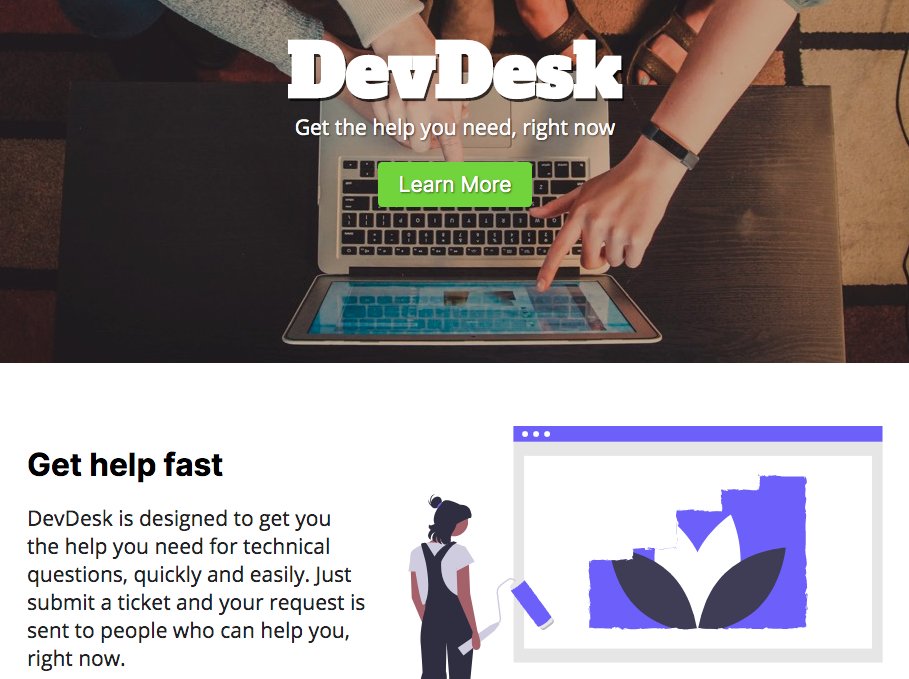

import TitleLink from "../../src/components/title-link"

<TitleLink {...props} />

This was my first Build Week project at Lambda School. As a UI Developer, I designed and developed the landing page for the help desk app, in addition to contributing to the styling of the React client.
