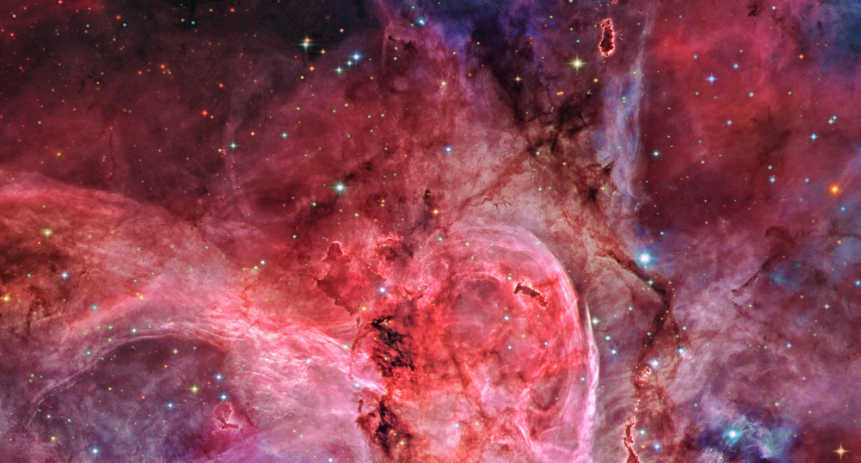

I created this React image viewer for desktop browsers, to take advantage of the high-resolution images provided by the [NASA API](https://api.nasa.gov/). I took the initiative to go beyond the standard curriculum and implemented an in-memory cache in order to limit network requests and improve performance.