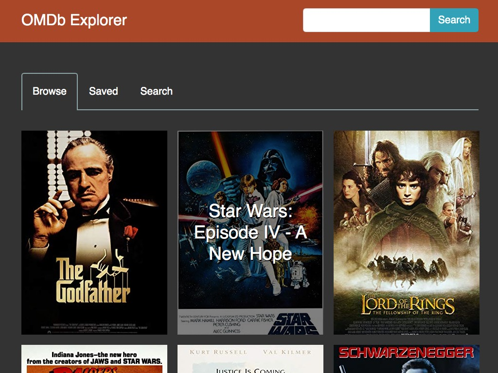

I created this app to browse through movies from the [OMDb API](http://www.omdbapi.com/). The app allows the user to browse through a list of movies and save their favorites to a list. It also has a search function, which displays data returned from the API, using React Router to navigate through paginated results.